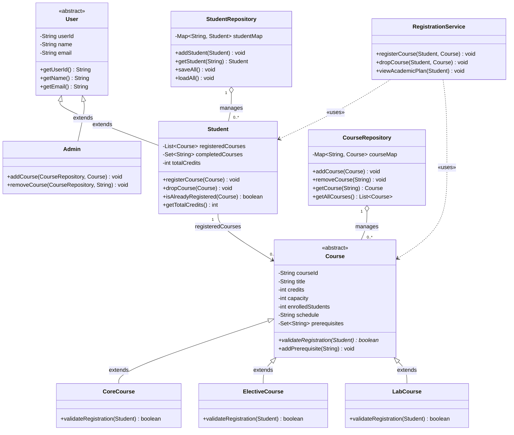

```mermaid
classDiagram
    direction TB

    class User {
        <<abstract>>
        -String userId
        -String name
        -String email
        +getUserId() String
        +getName() String
        +getEmail() String
    }

    class Student {
        -List~Course~ registeredCourses
        -Set~String~ completedCourses
        -int totalCredits
        +registerCourse(Course) void
        +dropCourse(Course) void
        +isAlreadyRegistered(Course) boolean
        +getTotalCredits() int
    }

    class Admin {
        +addCourse(CourseRepository, Course) void
        +removeCourse(CourseRepository, String) void
    }

    class Course {
        <<abstract>>
        -String courseId
        -String title
        -int credits
        -int capacity
        -int enrolledStudents
        -String schedule
        -Set~String~ prerequisites
        +validateRegistration(Student) boolean*
        +addPrerequisite(String) void
    }

    class CoreCourse {
        +validateRegistration(Student) boolean
    }

    class ElectiveCourse {
        +validateRegistration(Student) boolean
    }

    class LabCourse {
        +validateRegistration(Student) boolean
    }

    class RegistrationService {
        +registerCourse(Student, Course) void
        +dropCourse(Student, Course) void
        +viewAcademicPlan(Student) void
    }

    class CourseRepository {
        -Map~String, Course~ courseMap
        +addCourse(Course) void
        +removeCourse(String) void
        +getCourse(String) Course
        +getAllCourses() List~Course~
    }

    class StudentRepository {
        -Map~String, Student~ studentMap
        +addStudent(Student) void
        +getStudent(String) Student
        +saveAll() void
        +loadAll() void
    }

    %% Inheritance
    User <|-- Student : extends
    User <|-- Admin : extends
    Course <|-- CoreCourse : extends
    Course <|-- ElectiveCourse : extends
    Course <|-- LabCourse : extends

    %% Association: Student has registered courses
    Student "1" --> "0..*" Course : registeredCourses

    %% Dependency: RegistrationService uses Student and Course
    RegistrationService ..> Student : «uses»
    RegistrationService ..> Course : «uses»

    %% Aggregation: Repositories manage entities
    CourseRepository "1" o-- "0..*" Course : manages
    StudentRepository "1" o-- "0..*" Student : manages
```