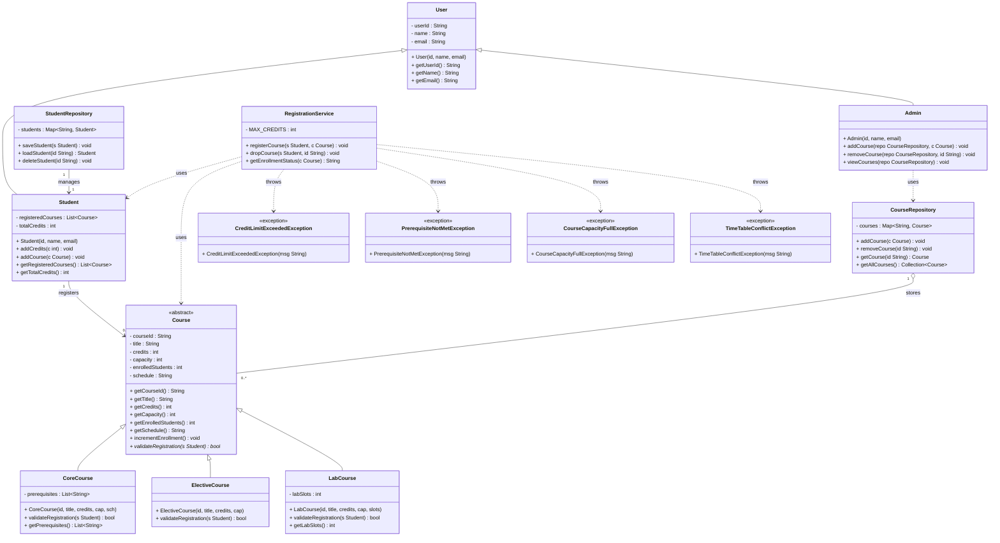

```mermaid
classDiagram
    direction TB

    class User {
        - userId : String
        - name : String
        - email : String
        + User(id, name, email)
        + getUserId() String
        + getName() String
        + getEmail() String
    }

    class Student {
        - registeredCourses : List~Course~
        - totalCredits : int
        + Student(id, name, email)
        + addCredits(c int) void
        + addCourse(c Course) void
        + getRegisteredCourses() List~Course~
        + getTotalCredits() int
    }

    class Admin {
        + Admin(id, name, email)
        + addCourse(repo CourseRepository, c Course) void
        + removeCourse(repo CourseRepository, id String) void
        + viewCourses(repo CourseRepository) void
    }

    class Course {
        <<abstract>>
        - courseId : String
        - title : String
        - credits : int
        - capacity : int
        - enrolledStudents : int
        - schedule : String
        + getCourseId() String
        + getTitle() String
        + getCredits() int
        + getCapacity() int
        + getEnrolledStudents() int
        + getSchedule() String
        + incrementEnrollment() void
        + validateRegistration(s Student) bool*
    }

    class CoreCourse {
        - prerequisites : List~String~
        + CoreCourse(id, title, credits, cap, sch)
        + validateRegistration(s Student) bool
        + getPrerequisites() List~String~
    }

    class ElectiveCourse {
        + ElectiveCourse(id, title, credits, cap)
        + validateRegistration(s Student) bool
    }

    class LabCourse {
        - labSlots : int
        + LabCourse(id, title, credits, cap, slots)
        + validateRegistration(s Student) bool
        + getLabSlots() int
    }

    class CourseRepository {
        - courses : Map~String, Course~
        + addCourse(c Course) void
        + removeCourse(id String) void
        + getCourse(id String) Course
        + getAllCourses() Collection~Course~
    }

    class StudentRepository {
        - students : Map~String, Student~
        + saveStudent(s Student) void
        + loadStudent(id String) Student
        + deleteStudent(id String) void
    }

    class RegistrationService {
        - MAX_CREDITS : int
        + registerCourse(s Student, c Course) void
        + dropCourse(s Student, id String) void
        + getEnrollmentStatus(c Course) String
    }

    class CreditLimitExceededException {
        <<exception>>
        + CreditLimitExceededException(msg String)
    }

    class PrerequisiteNotMetException {
        <<exception>>
        + PrerequisiteNotMetException(msg String)
    }

    class CourseCapacityFullException {
        <<exception>>
        + CourseCapacityFullException(msg String)
    }

    class TimeTableConflictException {
        <<exception>>
        + TimeTableConflictException(msg String)
    }

    User <|-- Student
    User <|-- Admin
    Course <|-- CoreCourse
    Course <|-- ElectiveCourse
    Course <|-- LabCourse

    Student "1" --> "0..*" Course : registers
    CourseRepository "1" o-- "0..*" Course : stores
    StudentRepository "1" --> "1" Student : manages

    Admin ..> CourseRepository : uses
    RegistrationService ..> Student : uses
    RegistrationService ..> Course : uses
    RegistrationService ..> CreditLimitExceededException : throws
    RegistrationService ..> PrerequisiteNotMetException : throws
    RegistrationService ..> CourseCapacityFullException : throws
    RegistrationService ..> TimeTableConflictException : throws
```